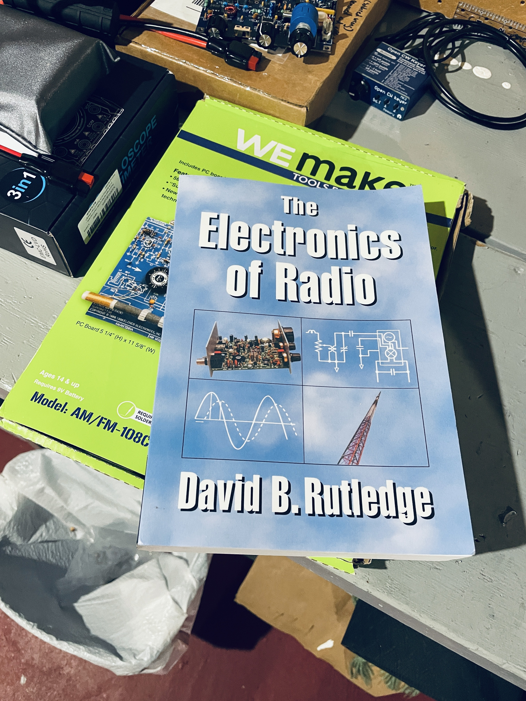
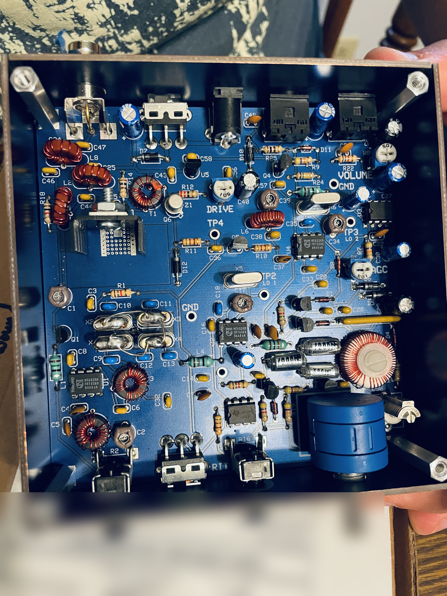
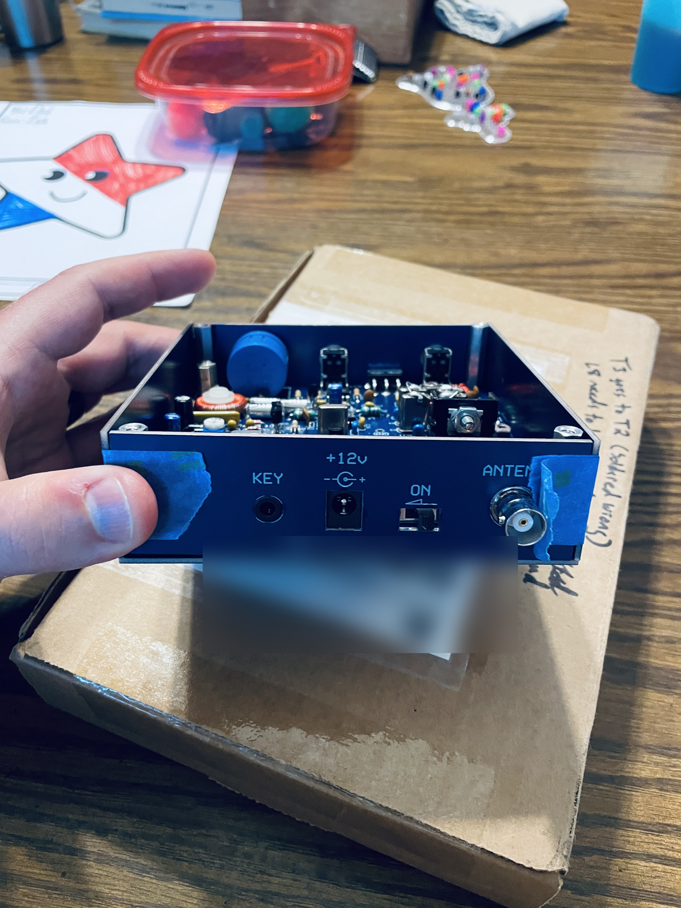
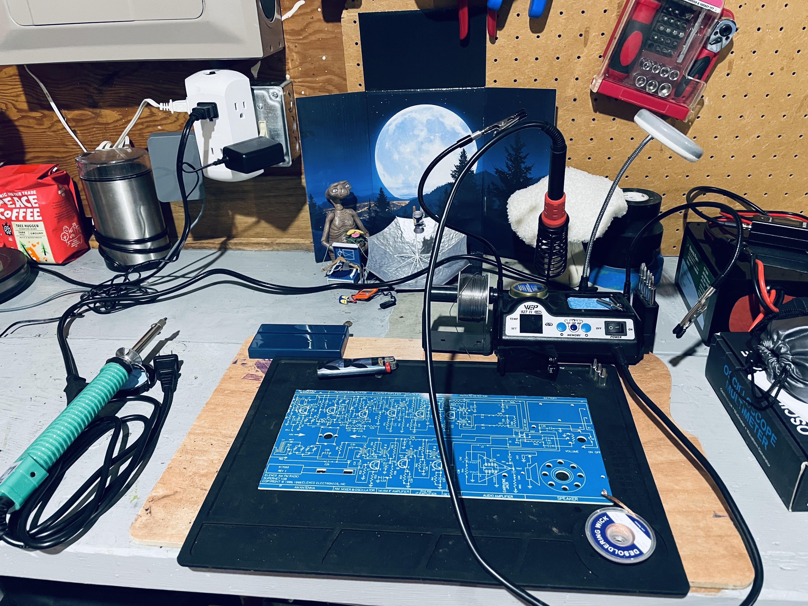

Leave it to me to choose the NorCal 40B as my first in-depth kit to build. I'll admit I didn't do proper research before purchasing and assembling it. What I really wanted was to see if I could actually build the thing and make it work — and, on top of that, to see how well it paired with *The Electronics of Radio* by David B. Rutledge, a book I have yet to fully understand, seeing as I have no background in electrical engineering, or RF engineering for that matter.

*The book, on top of the kit I should have started with.*

You may also notice from the photo that this book happens to be sitting on top of an Elenco AM/FM-108CK superhet radio kit. That is what I should have actually started with. It only covers the receiver side of radio, but it's extremely educational — and since starting the manual, I've realized the receiver is half the battle anyway (to an extent). So in between my alignment/testing/tuning frustrations with the NorCal 40B, I've started working on the AM/FM kit to gain (pun intended) a better understanding of radio in general.

Now that I've got that off my chest, let's talk about the NorCal 40B — why I chose it, and the difficulties that led me to bench it until I've got a better handle on what I'm doing.

## About the NorCal 40B

So what exactly is the NorCal 40B? In short, it's a single-band, 40-meter, CW-only QRP transceiver — a little radio that sips power and speaks nothing but Morse. Its lineage runs deep. The original NorCal 40 started life as a project of the Northern California QRP Club (NorCal for short) back in the early '90s, designed by Wayne Burdick, N6KR — the same Wayne who'd go on to co-found Elecraft. It was refined into the wildly popular NorCal 40A, kitted and sold by Wilderness Radio, and over the years thousands of hams cut their teeth on it both at the home station and out in the field.

Eventually the original kit went out of production as parts became obsolete, and that's where the "B" comes in: David Cripe, NM0S, got Wayne's blessing to revive the design, engineer around the unobtainium, and wrap it all in a rugged, pre-drilled and silkscreened enclosure with everything board-mounted — virtually no chassis wiring to fuss with. That's the version currently taking up space on my bench.

Under the hood it's a proper little superhet: a 400 Hz crystal filter, RIT, AGC, smooth T-R switching, somewhere in the neighborhood of 1 to 3 watts out, and a stingy 15 to 20 mA draw on receive — exactly what you want when you're hauling a rig up a hill or out to a park.

And here's the detail that made me feel a little called out. Remember that copy of *The Electronics of Radio* — the one in the photo? David Rutledge built that entire Cambridge textbook around the NorCal 40A. The lab exercises walk you through designing, building, and testing this very radio — well, its direct ancestor. So yes: I managed to buy the one QRP kit that has a full college-level electronics course written about it, and then acted surprised when it turned out to be more than a plug-and-play afternoon.

## Why I chose it

I chose this project because I'm absolutely amazed by QRP and CW. Not only that, but both come paired with a level of frustration that's led me to quit entirely in the past. For the longest time I could not grasp CW. I learned the letters and some punctuation, and I could transmit fine (or so I thought), but when it came to receiving anything faster than about 10 words per minute, I felt like my brain was having a frequency-induced seizure trying to decode on my own.

And yes — before you suggest a decoder — I've used or tried several, and I'm not a fan. Plus, I'm stubborn, and I feel the only way to pay proper tribute to the CW operators who came before me is to do it the old-school way. I've been getting better at it by the day.

Having said all that, the NorCal 40B seemed like a cost-effective way to get a 40m CW machine on the bench — one I could build to advance my QRP and CW chops while also expanding my knowledge of electronics and circuits. As it turned out, the QRP and CW part held true; the electronics-and-circuits part hasn't really happened with this kit.

## The difficulties

This kit opened my eyes to the fact that there are kits, and then there are educational kits. The NorCal 40B is the first kind: essentially plug-and-play, with instructions that assume you're already familiar with every concept in them. You can figure out the parts, where to solder them, and understand the warnings — the issues with putting in, say, a polarized capacitor or a diode backwards — but once it's built, the troubleshooting and alignment instructions assume too much knowledge. The Elenco AM/FM kit is the second kind: it assumes less. It's still not really aimed at beginners — a few assumptions are baked in — but it gives you a ton of information and great testing material. That gap is why I've had to bench the NorCal 40B for a bit.

I didn't have any problems soldering the components onto the NorCal 40B — at least none that weren't my own mistakes. For example, I botched a wrap on the L8 toroid and didn't notice until after I'd soldered it in and clipped its pins. I also soldered the T2 toroid into T3's through-hole pins. Thankfully, I was able to make all the fixes without needing new wiring for either.

The upside: it gave me a reason to buy a desoldering iron and pick up some additional techniques — after I'd tried and failed numerous times to desolder the simple way with braided copper wick. What I found was that heating the entire board with my wife's hairdryer — getting the ground plane nice and warm before going in with the iron — was the golden ticket. That's a lesson I'll never forget.

*The finished board. Every joint on it is mine — including the ones I did twice.*

Another big mistake came after I'd completed the board. I taped the side panels on to give it a mock-build look, leaving the components exposed so I could check on them during the first power-up. Needless to say, since I hadn't actually soldered those side panels to the board, they created a short. I had no audio in my headset when I first powered it on. I was, however, extremely happy that nothing exploded or overheated — and I only discovered the short after a midnight thought jolted me out of bed to pull off the false casing and test it again. This time I had audio in my headset.

*The "mock build," panels taped on. The handwritten T3/T2 note is exactly what it looks like — a reminder I earned.*

So it was time to move on to the tuning and alignment process — except this just wasn't working. Nothing much was happening, even though the audio sounded great. To make things worse, while hooked up to my Chameleon CHA LEFS 4010 (an end-fed half-wave antenna), I couldn't hear any sidetone in my headset when I keyed up. I went back to the first troubleshooting step in the alignment, which had me looking for a current draw of around 18 mA with the radio connected to power. The annoying part: my ANKG power meter, wired between the battery and the radio, doesn't measure down that low. So I'm currently in the middle of making a cable to take that measurement with my IMARS 3-in-1 oscilloscope, noise generator, and digital multimeter.

And thus, I've benched my NorCal 40B until further motivation strikes. Until then, I'll be working on the Elenco AM/FM kit — at least until I need a break from that too.

*Next up: the Elenco board, irons ready. E.T. supervises.*

Remember, dear reader: there are never too many projects, only too little time to complete them. Always keep your bench stocked and take breaks often, especially when you're learning or doing something new. And finally — spend time with friends and family, and get away from the internet, your phone, and any other distractions more often than not.

Until next time! This is K9MTE, saying 73.
