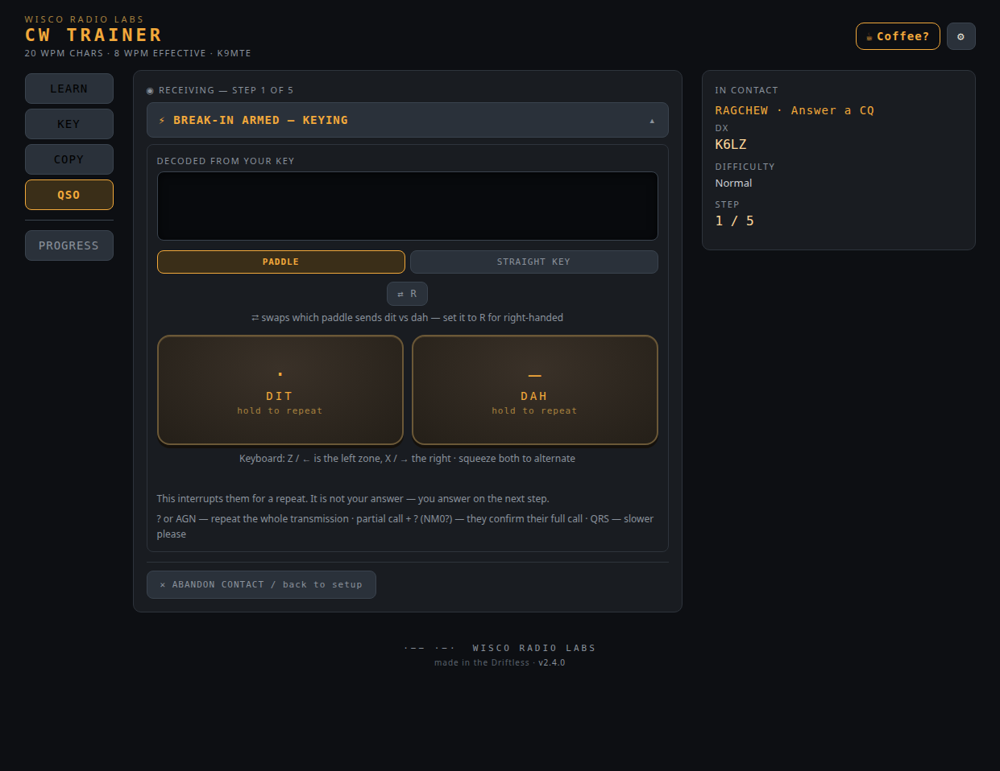
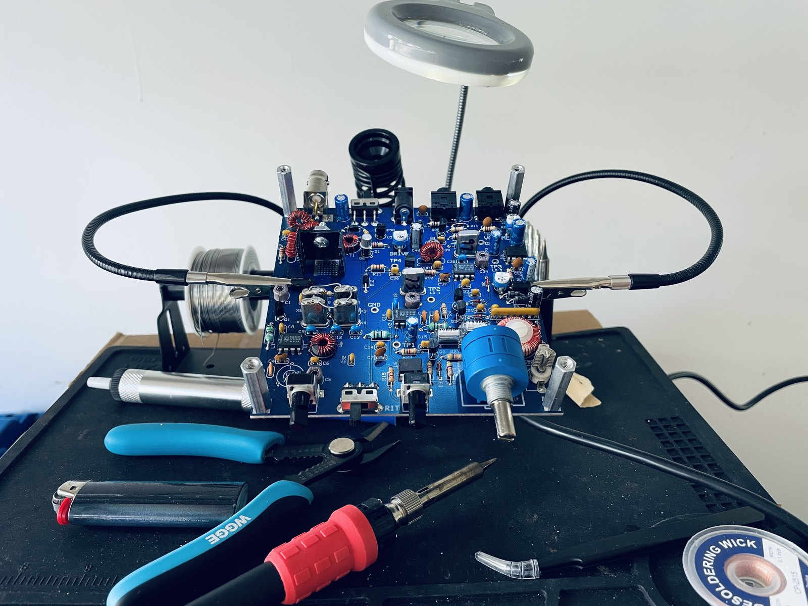

Ham radio, built in the open.

That's the whole thing in five words. Here's the longer version.

## Why this exists

I'm Travis Engh — K9MTE. I'll level with you up front: I'm not a good CW (Morse code) operator. I'm barely an operator at all. I've sat down to get on the air in Morse more than once, gotten in my own head, and backed off. That's the actual reason Wisco Radio Labs exists — I went looking for a tool to fix that, didn't find the one I wanted, and built my own.

There are good CW trainers out there. Some drill your copy until you can receive clean; some gamify both receiving and sending across hundreds of levels. They sharpen the individual skills. But the individual skills were never my problem.

It was the live back-and-forth of a real QSO (an on-air contact): copy what the other operator sends, key your reply without your fist (your personal sending rhythm) falling apart, and keep the conversation going — all at once. That's what kept me off the air — and the part no trainer I tried actually drilled.

That's what the CW Trainer is built around. It still teaches the characters the right way — the Koch method, where you learn each one as a sound instead of decoding dots and dashes. But the point is the part nobody really rehearses: it puts you on the key with feedback on your fist, builds your copy speed, then drops you into a simulated QSO — activating a park, working a summit, a relaxed ragchew (casual chat). The closest thing to being on the air without keying up.

So I built it. Then I built it again, better. Then I shipped it on Linux.

## The CW Trainer

The [CW Trainer](/products/) is the first product out of Wisco Radio Labs — live on the Snap Store (the Linux app store) at v2.4.0. The QSO simulator covers POTA, SOTA, and IOTA (Parks, Summits, and Islands on the Air), plus ragchews.



It's fully offline. Free. Open source under GPL-3.0-or-later.

```
snap install wr-cw-trainer
```

Polishing the Linux desktop build is my focus right now. The real next step is mobile — Android and Apple. On Windows or Mac? It's open source, so you can clone the repo and run it from source — I'm not chasing the app stores there.

## What this site is for

This is the bench log. I'll write here about what I'm building, how it's going, and what I got wrong the first time — which, if the CW thing is any indication, will be a recurring feature.


*A NorCal 40B QRP CW kit from NM0S Electronics, mid-build.*

Showing the work like that is a Driftless habit. The Driftless Area of southwest Wisconsin is a specific place — old hills and river valleys, stubbornly themselves while the rest of the Midwest was flattened and then sprawled. "Made in the Driftless" is half geography, half attitude: build it well, make it repairable, show the work. The bench log is that last part.

73 (best regards) de K9MTE
